# Latest AI Innovations and Skills

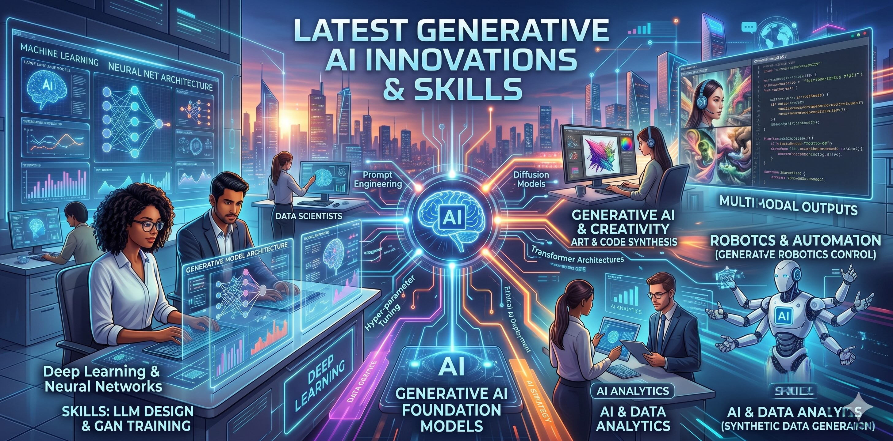

This repository is dedicated to showcasing the latest innovations and skills in the field of Artificial Intelligence (AI). It serves as a comprehensive resource for educators and practitioners to stay updated with the cutting-edge developments in AI technologies. It includes advanced prompting skills, new AI features, building custom AI assistants and hands-on agentic AI.

# Hello! My name is Sunny 🌞


[Sunny Ng](https://training.imagenation.com.hk/#sunny-ng)  
**Founder / Master Trainer** at [Image Nation](https://training.imagenation.com.hk)  
**Part-time Lecturer** at HKU Business School, HKU School of Chinese, HKUSPACE, EdUHK  
**Email**: sunny.ng@imagenation.com.hk or sunnyng@eduhk.hk

# Useful Keyboard Shortcuts

| Keyboard Shortcut | Description                                         |
| ----------------- | --------------------------------------------------- |
| `SHIFT` + `ENTER` | Move cursor to next line without sending out prompt |
| `CTRL` + Click    | Open a link in a NEW browser tab                    |
| `ALT` + `=`       | Insert / Edit LaTex                                 |
| `CTRL` + `Z`      | Undo last action                                    |
| `CTRL` + `C`      | Copy selected text                                  |
| `CTRL` + `V`      | Paste copied text                                   |
| `WIN` + `D`       | Show Windows Desktop                                |
| `CTRL` + `F`      | Search on the current page                          |

# Popular GenAI Tools

It is more effective to keep multiple browser tabs open for different tools.

To open the following AI tools in a **NEW** browser tab, hold `CTRL` (`CMD` on Mac) when clicking the links below.

- [Gemini](https://gemini.google.com) - Google Gemini is a powerful, multimodal large language model developed by Google that can understand and process a wide range of information, including text, images, canvas (apps),audio, and video.
- [Perplexity](https://www.perplexity.ai) - AI search engine that provides concise answers with sources.
- [Microsoft Copilot](https://copilot.microsoft.com/) - Free Microsoft AI assistant.
- [Grok](https://grok.com) - AI tool for generating text and code.
- [Poe](https://poe.com) - Platform to access multiple AI models in one place.
- [Qwen](https://chat.qwen.ai) - Conversational AI for various tasks
- [Doubao](https://www.doubao.com) - Conversational AI for various tasks
- [DeepSeek](https://www.deepseek.com) - Conversational AI for various tasks (**NOT** a multi-modal tool)
- [VisualGPT](https://visualgpt.io) - Photo Editor with AI / Image Generation
- [LMArena](https://lmarena.ai) - Compare and explore different large language models.
- [Notion AI](https://www.notion.com) - Note-taking and productivity app with AI features.
- [Napkin AI](https://www.napkin.ai/) - The visual AI for business storytelling.
- [Canva](https://www.canva.com) - Graphic design platform with AI-powered tools. Great for PowerPoint Generation.

# More on Popular AI Tools

- [Microsoft 365 Copilot](https://m365.cloud.microsoft/) - AI assistant integrated into Microsoft 365 apps.
- [narakeet](https://www.narakeet.com/languages/chinese-text-to-speech/) - Easily Create Voiceovers Using Realistic Text to Speech
- [ElevenLabs](https://elevenlabs.io) - AI-powered text-to-speech platform.
- [Cleanvoice AI](https://cleanvoice.ai) - Audio editing tool that removes filler words, stutters, and long pauses from audio recordings.
- [Yeri AI](https://yeri.ai/) - Open-source image generation model. Previously known as Stablediffusion.
- [Kling AI](https://app.klingai.com) - AI-powered video creation platform.
- [Hailuo AI](https://hailuoai.video) - AI-powered video creation platform.
- [Runway](https://runwayml.com) - AI-powered video editing and creation
- [newarc](https://www.newarc.ai/) - AI-powered fashion creative platform.
- [Tripoai](https://studio.tripo3d.ai) - AI-powered 3D content creation platform.
- [ideogram](https://ideogram.ai/) - AI-powered image generation platform.

# Other Tech Tools for Teaching & Learning

- [Google Sites](https://sites.google.com/) - Free website builder by Google, great for creating a class website or portfolio.
- [DILLINGER](https://dillinger.io/) - Online Markdown playground/editor.
- [Pandoc](https://pandoc.org/index.html) - Universal document converter that can convert between various formats, including Markdown, HTML, PDF, and more.

# Mastering RICE FACT Effective Prompting

RICE FACT is a useful framework to help you structure your prompts effectively when using AI tools. It stands for Role, Instruction, Context, Example, Format, Action, Constraint, and Tone. By incorporating these components into your prompts, you can guide the AI to generate more accurate and relevant responses.

There are other prompting frameworks such as **ICIO** (Instruction, Context, Input, Output), **SCQA** (Situation, Complication, Question, Answer) and **STAR** (Situation, Task, Action, Result), they all have their own advantages and disadvantages. RICE FACT is more comprehensive and flexible, allowing you to include various elements in your prompts to achieve better results.

**Beginner Pitfall**: AI beginner users tend to use simple Instruction-only prompts, which often lead to vague and irrelevant responses. By adding more prompt components such as Role, Context, Example, Format, Action, Constraint, and Tone, you can significantly improve the quality of the AI's responses.

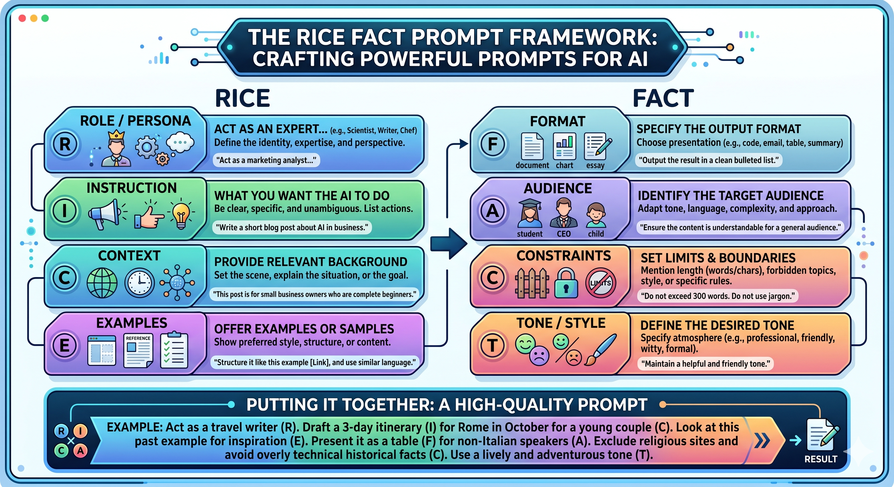

**Tips 1**: You can just click the copy button to replicate the prompt in your AI assistant. It's OKAY to include the RICE FACT tags in your prompt.  
**Tips 2**: In your future prompting, You DON'T actually have to specifically add these tags in your prompts. They are just there to help you better understand the prompt structure.  
**Tips 3**: It seldom include all RICE FACT components in a single prompt.  
**Tips 4**: In some articles, A is referred as Action while some other articles refer to it as Audience. You can choose either one depending on the context of your prompt.

**Instruction** only

```
Role        →
Instruction → Explain what GenAI is.
Context     →
Example     →
Format      →
Action      →
Constraint  →
Tone        →
```

---

**Instruction** + **Format**

```
Role        →
Instruction → Explain what GenAI is.
Context     →
Example     →
Format      → Use one sentence.
Action      →
Constraint  →
Constraint  →
```

---

**Role** + **Instruction** + **Format**

```

Role        → You are a secondary teacher.
Instruction → Explain what GenAI is.
Context     →
Example     →
Format      → Use one sentence.
Action      →
Constraint  →
Tone        →

```

---

**Role** + **Instruction** + **Format**

```

Role        → You are a kindergarten teacher.
Instruction → Explain what GenAI is.
Context     →
Example     →
Format      → Use one sentence.
Action      →
Constraint  →
Tone        →

```

---

**Role** + **Instruction** + **Context**

```

Role        → You are a tech trainer.
Instruction → Explain what GenAI is.
Context     → The target audience are non-technical executives.
Example     →
Format      →
Action      →
Constraint  →
Tone        →

```

---

**Instruction** + **Format**

```
Role        →
Instruction → Explain what GenAI is.
Context     →
Example     →
Format      → Use three bullet points.
Action      →
Constraint  →
Tone        →
```

---

**Instruction** + **Format** + **Constraint**

```
Role        →
Instruction → Explain what GenAI is.
Context     →
Example     →
Format      → Use three bullet points.
Action      →
Constraint  → Each bullet points not more than 15 words.
Tone        →
```

---

**Instruction** + **Example**

```
Role        →
Instruction → Generate 10 dummy customer records as below
Context     →
Example     → CustID, CustName, Email, Mobile, Address
Format      →
Action      →
Constraint  →
Tone        →
```

---

# Managing Prompts and AI Responses

To effectively manage your prompts and the AI's responses, it's important to keep a record of your interactions. This can help you track the effectiveness of different prompts and refine your approach over time. You can use tools like Notion to document the AI's responses, and any notes on what worked well or what could be improved. This practice will enable you to build a library of effective prompts that you can refer back to in the future.


Notion is a great tool for this purpose because it allows you to organize your prompts and responses in a structured way, making it easy to review and analyze your interactions with the AI.

It supports rich block types, such as text, headings, bullet points, tables, and more, which can help you format your notes effectively. You can also use Notion's database features to create a searchable library of prompts and responses, making it easier to find specific interactions when needed.


## Let's Practice Notion

- Adding New Page
- Giving Page Title
- Add a banner image to theme a page
- Add icon to make the page more recognizable
- Adding images
- Adding embedded videos
- Adding Google Map
- Cross-device features

# Image Editing & Generation

Open [VisualGPT](https://visualgpt.io)


VisualGPT is an AI-powered photo editor and image generation tool that allows users to enhance and create images using natural language prompts. It can perform various tasks such as editing photos, generating new images based on descriptions, and applying artistic styles to existing images. With VisualGPT, users can easily transform their ideas into visual content without needing advanced design skills.

# Using Google NanoBanana

Google NanoBanana is a powerful image generation model that can create high-quality images based on text prompts. It is designed to be efficient and accessible, allowing users to generate images quickly and easily. To use Google NanoBanana, simply provide a descriptive text prompt, and the model will generate an image that matches the description. This tool is particularly useful for artists, designers, and anyone looking to create visual content without needing to start from scratch.


In Google Gemini, choose the "Create image" option to access the NanoBanana model. It allows you to create unique and personalized images for various purposes, such as social media posts, presentations, or creative projects.

**See some samples prompts and generated images below:**

```
Minimalist isometric 3D graphic of an algebraic function machine. A bright orange box with a funnel on top labeled "Input x" and a conveyor belt coming out of the bottom labeled "Output y". Clean lines, modern educational tech style, isolated on a solid light gray background.
```


---

```
A crisp vector diagram demonstrating the Pythagorean theorem. A perfect right-angled triangle in the center. On each of the three sides, a perfect square is built out. The squares are shaded in translucent shades of blue, teal, and purple. Labels 'a²', 'b²', and 'c²' are neatly centered inside each corresponding square. Flat design, white background.
```

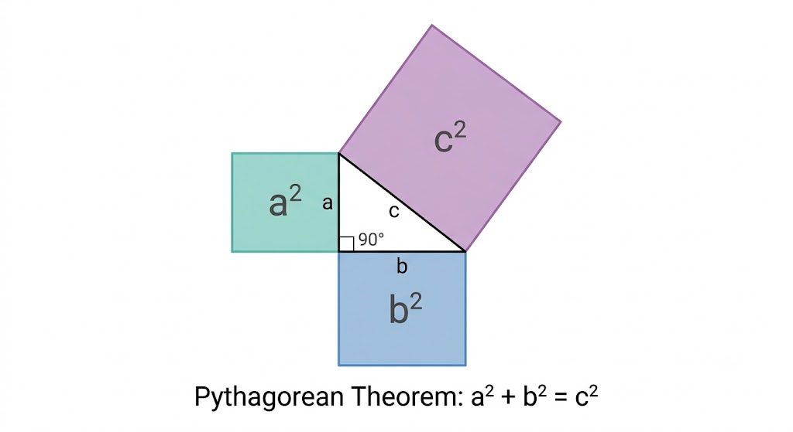

---

```
A flat vector style educational illustration showing a lighthouse on a cliff and a small sailboat out at sea. A subtle, dashed golden line represents the line of sight from the lighthouse down to the boat, forming a clear angle of depression. Clean, simple shapes, daytime, bright colors, perfect for a secondary school math worksheet diagram.
```

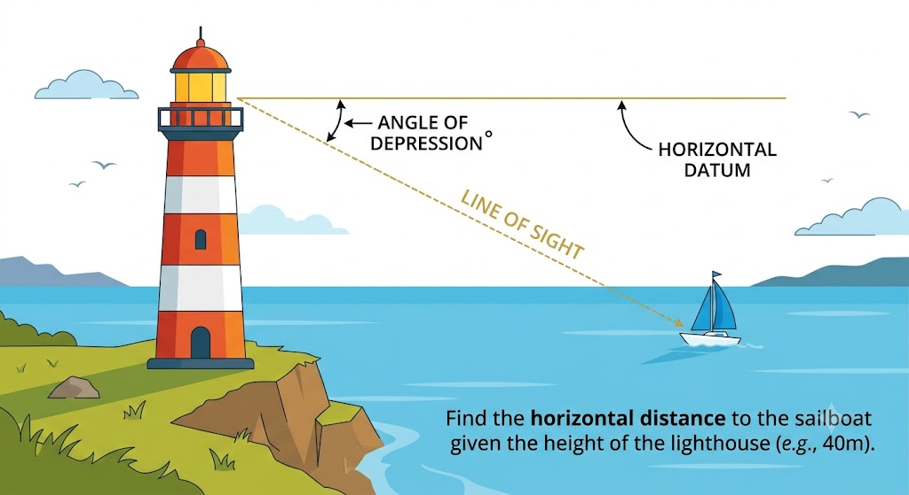

---

```
An isometric illustration of a classic "Shortcut Dilemma" real-world math problem. A rectangular green park with a paved gray walking path along the two outer edges, and a dirt path cutting diagonally across the grass from one corner to the opposite corner. Simple, clear, cartoon-vector style, isolated on white.
```

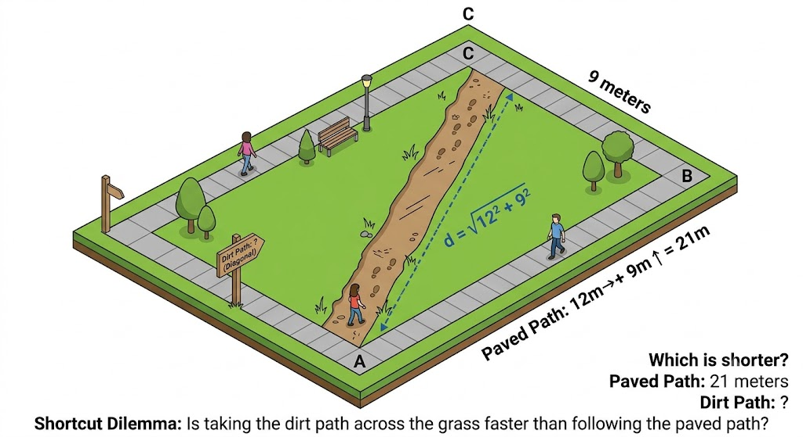

---

```
A flat vector design of a probability sample space. A large transparent glass jar filled with exactly 5 red marbles, 3 blue marbles, and 2 green marbles. Beside the jar, a spinning wheel with uneven colored sectors. Clean infographic style, bright playful colors, isolated on a white background.
```

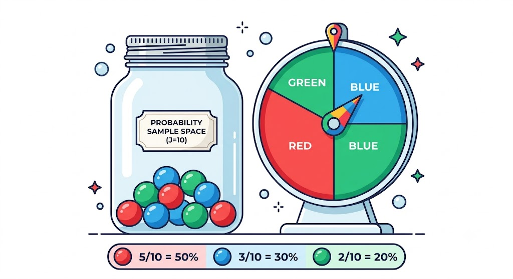

---

```
A clean, 3-set Venn diagram vector illustration. Three overlapping circles colored in translucent pastel shades of cyan, magenta, and yellow, creating distinct intersection zones. Minimalist style, high contrast, perfect for secondary school logic and probability teaching slides.
```

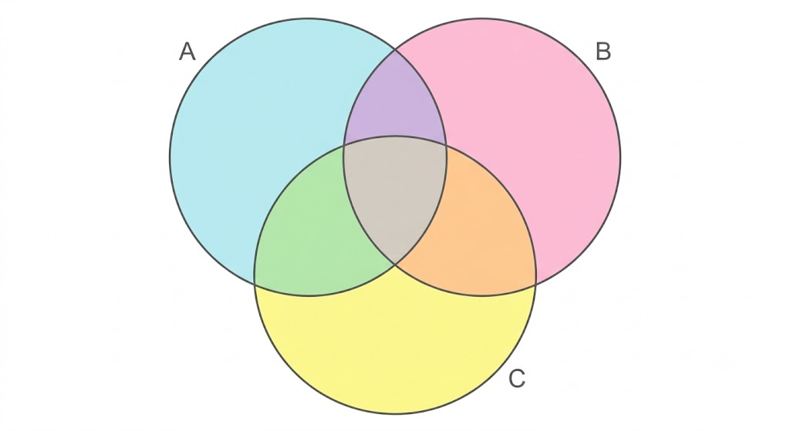

---

```
A 2D geometry diagram for a math assessment on a solid white background. A perfect square with sharp black outlines contains a perfectly centered circle inside it that touches all four sides. The region inside the square but outside the circle is shaded in a light, solid grey color. The bottom edge of the square is labeled "14 cm". Sharp lines, flat design, top-down view, no 3D perspective, no textures. Clean textbook illustration style.
```

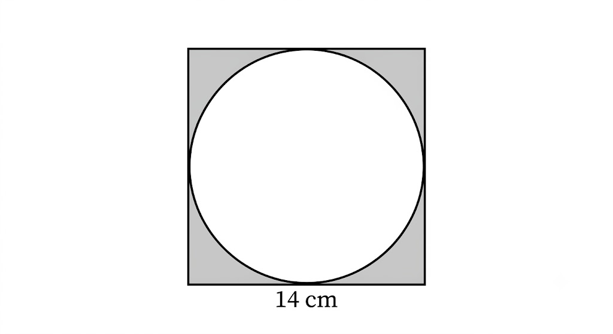

---

```
A flat 2D geometric diagram of a composite shape consisting of a rectangle with a right-angled triangle attached to its right side. Black outlines on a crisp, solid white background. The rectangle base is labeled "8 cm" and its height is labeled "5 cm". The triangle's base extends out, and its hypotenuse is visible. The total bottom length of the entire shape is labeled "12 cm". Textbook style, 2D vector illustration, top-down view, no shading, no 3D elements. Clear, legible font for numbers.
```

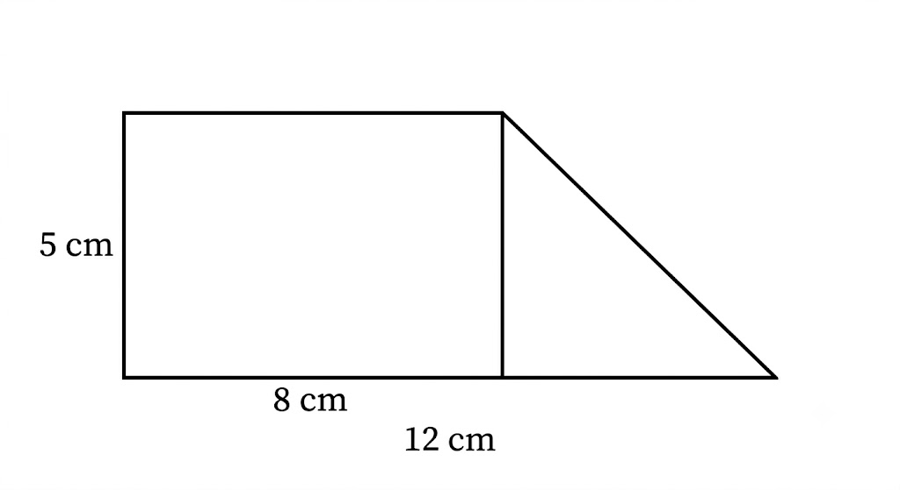

---

## Visual Ingredients for Effective Images Generation

To create an effective prompt for AI image generation, focus on these visual "ingredients" to ensure a high-quality, coherent result:

- **Subject**: Define the main focus (e.g., a person, an object, a specific landscape).
- **Action/Interaction**: Describe what the subject is doing or how they relate to the environment.
- **Environment/Setting**: Specify the location, background, and surroundings.
- **Composition & Camera Angle**: Determine the perspective (e.g., wide shot, close-up, top-down, eye-level).
- **Lighting**: Define the mood via light (e.g., cinematic lighting, golden hour, soft diffuse light, dramatic shadows).
- **Artistic Style/Medium**: Set the aesthetic (e.g., hyper-realistic photography, oil painting, 3D render, minimalist vector art).
- **Color Palette**: Specify the dominant colors or color mood (e.g., warm earthy tones, monochromatic, vibrant neon).
- **Level of Detail**: Indicate the visual quality (e.g., intricate details, 8k resolution, film grain, sharp focus).

# Video Generations

Video generation is an emerging field in AI that allows users to create videos based on text prompts or other input data. This technology can be used for various applications, such as creating educational content, marketing videos, or even entertainment. With video generation tools, users can easily produce high-quality videos without needing advanced video editing skills.

Video generation cost is generally higher than image generation due to the increased complexity and computational resources required to create videos. Free video generation tools may have limitations on the length and quality of the videos they can produce, while paid tools often offer more features and higher quality outputs. It's important to consider your specific needs and budget when choosing a video generation tool.

## Use Cases of Generative Video in Math Education

Dynamic Visualization of Abstract Concepts - Many algebraic and geometric concepts are difficult for students to grasp through static textbook images. Generative video can create smooth, dynamic animations that show how mathematical structures change in real-time.

- **Graph Transformations**: Instead of just showing the final graph, a video can dynamically show how changing the values of $a$, $h$, and $k$ in a quadratic function $f(x) = a(x-h)^2 + k$ shifts and stretches the parabola.
- **The Unit Circle and Trigonometric Functions**: A video can animate a point moving around the unit circle while simultaneously tracing the corresponding sine or cosine wave on a coordinate plane, explicitly linking the circle to the wave function.
- **Optimization and Geometry Problems**: If a problem asks for the maximum volume of a box made from a flat sheet of cardboard, a generative video can show the cardboard folding into different box shapes, visually demonstrating how the volume changes based on the cut size.
- **Visualizing Geometric Proofs**: Instead of static steps, a video can show shapes cutting, rotating, and rearranging themselves to prove theorems visually, such as the Pythagorean theorem (e.g., showing the areas of the two smaller squares literally pouring into the larger square).

```
Create a clean video to show a simple matrix calculation
```

[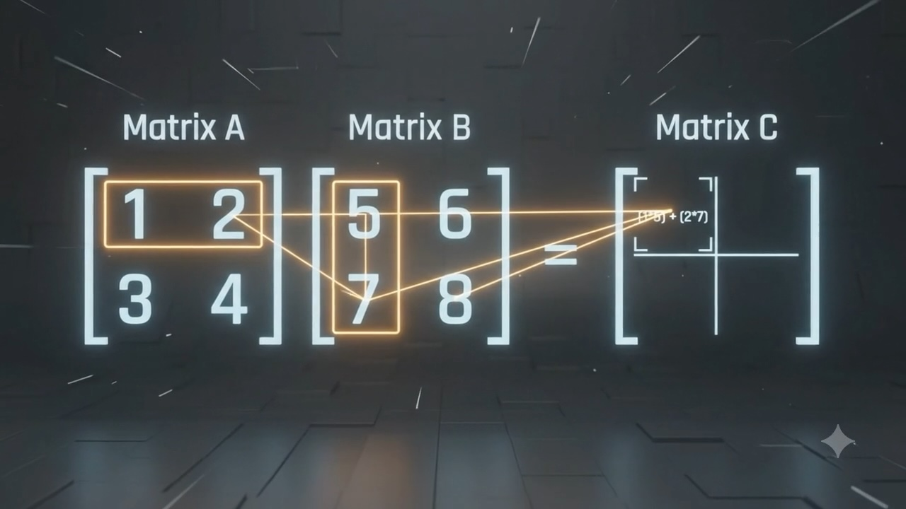](./images/matrix-calculation.mp4)

**Tips**: Video generation is still in its early stages, and the quality may not be perfect. And it's often slow and expensive. It's been improving rapidly though. At this moment, generative web-based interactive canvas (e.g., Google Gemini Canvas) may be a more practical option for educators to create dynamic visualizations for teaching purposes, while waiting for the video generation technology to mature further. We will experience Gemini Canvas soon.

---

## Let's try [Yeri AI](https://yeri.ai/)


Yeri AI offers free daily credits to experiment with video generation. You can use it to create simple videos based on your prompts. While the quality may not be perfect, it's a great way to get started with video generation and explore the possibilities of AI-generated content.

---


You can also try [Qwen](https://chat.qwen.ai/) for video generation. It's not the best, but it offers certain free credits for everyday use and it's constantly improving.

## Visual Ingredients for Effective Video Generation

For high-fidelity video generation, you need to incorporate dynamic "ingredients" that control movement, temporal consistency, and audio integration. Here are the core elements to include:

- **Core Subject & State**: Clearly define the subject and its starting state (e.g., "a golden retriever sitting on a porch").
- **Motion & Action**: Specify the direction, speed, and nature of the movement (e.g., "camera pans slowly left," "subject slowly stands up and wags tail").
- **Temporal Progression**: Describe how the scene changes over time to ensure a coherent narrative arc.
- **Environmental Dynamics**: Include shifting ambient elements (e.g., "leaves blowing in the wind," "changing light patterns," "moving clouds").
- **Cinematography & Camera Movement**: Define the "shot" type (e.g., drone shot, dolly zoom, handheld shake, static tripod).
- **Lighting Transitions**: Describe how light changes throughout the video (e.g., "daylight transitioning into a warm sunset").
- **Audio/Soundscape Cues**: Include auditory details (e.g., "ambient sound of wind," "soft melodic piano background," "synchronized footsteps").
- **Visual Style & Texture**: Define the look and feel (e.g., cinematic film grain, 16mm vintage aesthetic, high-frame-rate realism).

# Turn Texts into Visuals


[Napkin AI](https://napkin.ai/) is a powerful tool that allows you to turn your text-based ideas into compelling visual stories. It provides a user-friendly interface where you can input your text and generate visuals that enhance your storytelling. Whether you're creating a presentation, a report, or any other type of content, Napkin AI can help you make it more engaging and visually appealing.

1.  Paste the following prompt to any AI assistant to seek for answer on secondary math teacher assessment cycle.

    ```
    Use bullet points format to show the secondary mathematics assessment cycle for teacher.
    ```

2.  Copy the AI response and paste it to Napkin AI. You can then choose the most suitable visual template to turn the text into visuals.
3.  You can further customize the visuals by changing the colors, fonts, and layout to better suit your needs.
4.  Once you're satisfied with the visuals, you can download them and use them in your presentations, reports, or any other materials to enhance your communication and engagement with your audience.

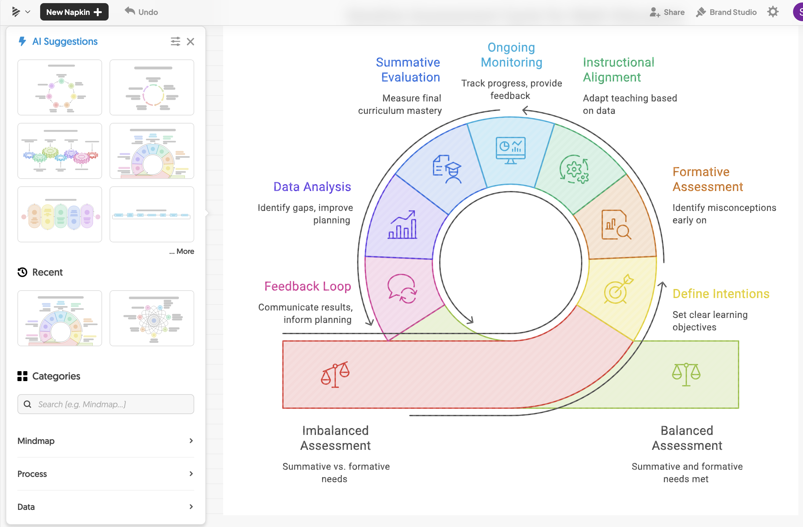

# Power Point Generation

[Canva AI](https://www.canva.com/ai/) is a powerful tool that allows you to generate PowerPoint presentations quickly and easily. With Canva AI, you can create professional-looking slides by simply inputting your content and selecting a design template. The AI will then automatically format your slides, add relevant images, and suggest layouts to make your presentation visually appealing. This tool is especially useful for educators and professionals who need to create presentations on a regular basis, as it saves time and effort while still producing high-quality results.


# Speech Synthesising


[Narakeet](https://www.narakeet.com/) is an AI-powered text-to-speech tool that allows you to create realistic voiceovers for your videos, presentations, or any other content. With Narakeet, you can simply input your text, choose from a variety of voices and languages, and generate high-quality audio that sounds natural and engaging. This tool is particularly useful for educators, marketers, and content creators who want to add a professional touch to their projects without needing to hire voice actors or spend time recording audio themselves.


# Vibe Coding


[Vibe Coding](https://vibecoding.com/) is an AI-powered coding assistant that helps developers write code more efficiently. It provides real-time suggestions, code completions, and error detection to enhance the coding experience. With Vibe Coding, you can focus on your logic and creativity while the AI takes care of the syntax and structure, making it easier to write clean and efficient code. This tool is especially beneficial for both beginner and experienced programmers who want to improve their coding skills and productivity.

## Let's use Gemini to generate Canvas outputs


Gemini Canvas is a powerful tool that allows you to create interactive and dynamic content using a visual interface. It enables you to design and build applications, games, and other digital experiences without needing to write code. This tool is particularly useful for educators and developers who want to create interactive learning materials or prototypes quickly and efficiently.

Use the following prompts to create a simple interactive canvas.

---

```
Create a playground for student to explore Pythagorean theorem
```

Use the above prompt in Gemini to create your own canvas or click the link below to see my pre-generated canvas.

[Playground for Pythagorean Theorem](https://gemini.google.com/share/a458c0cbdb1d)

---

```
generate an html animation to show the concept of binomial formula
```

Use the above prompt in Gemini to create your own canvas or click the link below to see my pre-generated canvas.

[Binomial Formula Animation V1](https://gemini.google.com/share/e91b2e1053c9)

---

```
create an interactive simulation to help students understand the concept of binomial formula
```

Use the above prompt in Gemini to create your own canvas or click the link below to see my pre-generated canvas.

[Binomial Formula Animation V2](https://gemini.google.com/share/d5fd067bae8d)

---

```
show a simple matrix calculation using html5 animation
```

Use the above prompt in Gemini to create your own canvas or click the link below to see my pre-generated canvas.

[Matrix Calculation Animation](https://gemini.google.com/share/538eea044790)

---

```
generate a simulation to teach student about bubble sort for data structures and algorithm introduction
```

Use the above prompt in Gemini to create your own canvas or click the link below to see my pre-generated canvas.

[Bubble Sort Simulation](https://gemini.google.com/share/823e6da5ae2f)

---

# Handy AI Tools / Features in Smart Phones

- iPhone Camera app for text extraction  
  

- **Google Photos** app can do above
- **Microsoft OneDrive** app can also do texts extraction
- **Google Lens** for image recognition and search
  
- **Google mobile app** supports text, voice, camera capture AI search
  

# Custom AI Assistants

Gemini Gems is a platform that allows you to create custom AI assistants tailored to your specific needs. With Gemini Gems, you can design and build your own AI assistant by defining its capabilities, personality, and interactions. This tool is particularly useful for educators, businesses, and individuals who want to create a personalized AI assistant that can help with tasks such as answering questions, providing recommendations, or assisting with specific workflows.


# Understanding Agentic AI

Agentic AI refers to artificial intelligence systems that possess a degree of autonomy and can make decisions or take actions on their own. These AI agents are designed to interact with their environment, learn from it, and adapt their behavior based on the information they receive. Agentic AI operates independently and make informed decisions without constant human intervention.

---

**Google Workspace Studio**  


---

**Microsoft Workspace Studio**  


---

# Interacting with Gemini Google Workspace Extensions

Google Workspace Extensions are AI-powered tools that integrate with Google Workspace applications like Gmail, Docs, Sheets, and Slides to enhance productivity and streamline workflows.

When you type the `@` symbol in the Gemini chat box, it brings up a quick-menu of available extensions.
This allows you to pull real-time information directly from your other Google apps into your conversation.

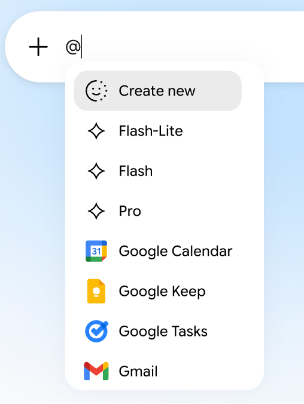
